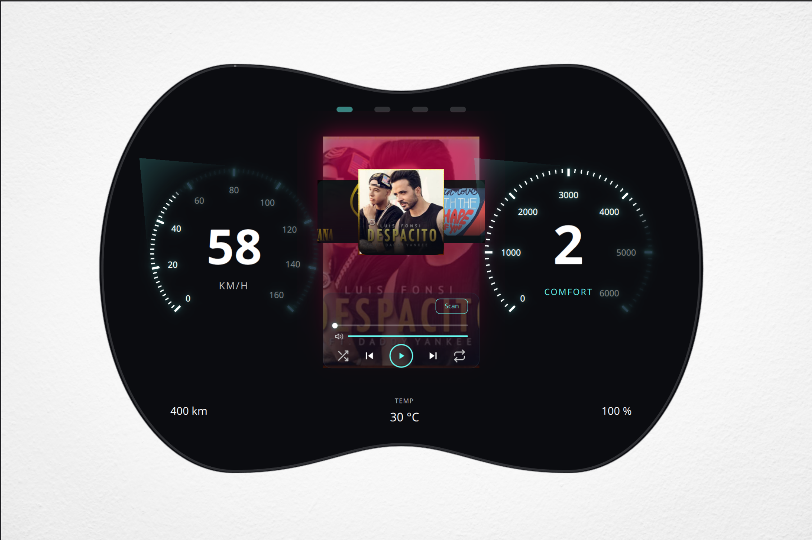
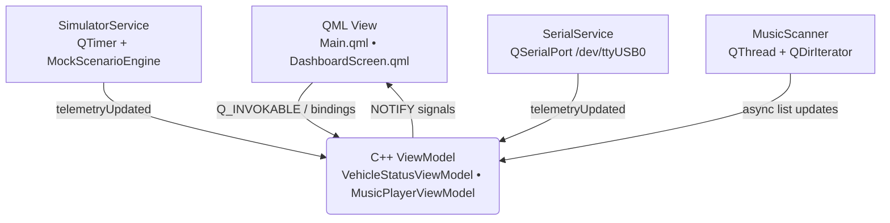

# QtStmAutomotiveSimulator

> A Neon Cyberpunk automotive dashboard built with **C++ 17 / Qt 6.8 / QML**, talking to a real **STM32F103C8T6** over UART — with a graceful runtime fallback to an in-process simulator when the hardware is disconnected.



---

## Table of Contents

- [Overview](#overview)
- [Key Features](#key-features)
- [Screenshots & Gallery](#screenshots--gallery)
- [Architecture](#architecture)
  - [The "Zero JavaScript" Rule](#the-zero-javascript-rule)
  - [Runtime Hardware Fallback](#runtime-hardware-fallback)
- [Technology Stack](#technology-stack)
- [Project Layout](#project-layout)
- [Prerequisites](#prerequisites)
- [Build & Run](#build--run)
- [Testing](#testing)
- [Hardware Integration (STM32 & UART)](#hardware-integration-stm32--uart)
  - [UART Protocol](#uart-protocol)
  - [Fail-Safes](#fail-safes)
- [Design System](#design-system)
- [Contributing / Development Rules](#contributing--development-rules)
- [Roadmap & Status](#roadmap--status)
- [License](#license)
- [Credits](#credits)

---

## Overview

`QtStmAutomotiveSimulator` is a scalable, highly interactive Qt 6 / QML desktop application that simulates a digital automotive dashboard. The UI is designed to morph across form factors (Bike ➔ Scooter ➔ HMI ➔ Car) with fluid, state-driven animations, backed by a robust C++ engine capable of consuming real-world UART telemetry from an STM32F103C8T6 ("Blue Pill") MCU.

**🎨 Design philosophy**: A *Neon Cyberpunk* UI shell — glassmorphism panels, tick-based neon gauge illumination, a custom frameless "Double Arch / Binocular" bezel silhouette, and a 3D cover-flow music widget. The look-and-feel you see in `dashboard-preview.png` above is the canonical reference for every visual decision in this project.

**🔌 Hardware story**: A real serial frame from the STM32 drives the same `ViewModel` surface as the in-process simulator. If you unplug the USB-TTL cable, the application **never freezes** — it detects the disconnect via a 500 ms watchdog and seamlessly hands telemetry over to `SimulatorService`.

---

## Key Features

- 🚫 **Zero JavaScript in QML** — every piece of logic lives in C++. `.qml` files contain only declarative property bindings, `Q_INVOKABLE` calls, and `States` transitions.
- 🧠 **MVVM enforced** — QML is a passive view; C++ exposes state via `Q_PROPERTY` with `NOTIFY` signals. Swapping the backend never requires a QML change.
- ⚙️ **Runtime Serial ⇄ Simulator fallback** — `main.cpp` wires both services simultaneously; whichever one reports `connectionStatusChanged(true)` wins until it times out.
- 🐕 **Watchdog + auto-reconnect** — `SerialService` marks telemetry stale after 500 ms of silence and tries to reopen the port on `errorOccurred`.
- 🌃 **Tick-based neon gauges** — `NeonTickGauge.qml` lights individual ticks (`isIlluminated`) instead of solid arcs — pure QML, no JS math.
- 🪟 **Double Arch / Binocular bezel** — A `Shape` with a precise `PathSvg` cubic bezier forms the physical dashboard silhouette in a `FramelessWindowHint` window.
- 🧊 **Glassmorphism panels** — Translucent `#2C353F` tinted base + diagonal gradients + edge fade masks create frosted-glass neon lighting.
- 🎵 **3D cover-flow music player** — Native `PathView` with `PathAttribute` provides a Zero-JS 3D carousel; audio is fully driven by `QMediaPlayer` inside `MusicPlayerViewModel`.
- 🧵 **Async media scanning** — `MusicScanner` runs `QDirIterator` on a `QThread`, so the QML render thread never blocks while scanning a directory of audio files.
- 🧪 **TDD by default** — Tests live alongside the code (`tests/`) and run via `ctest`.

---

## Screenshots & Gallery

### Dashboard Simulation Demo

Watch the simulator in action (including Neon UI, dynamic gauges, and music player):

<video src="resources/media/simulator-demo.webm" controls="controls" muted="muted" width="100%">
  <a href="resources/media/simulator-demo.webm">View Simulator Demo Video</a>
</video>

<!-- TODO: screenshot — Main dashboard in Bike form factor -->
<!-- TODO: screenshot — Serial disconnected state (auto-fallback to Simulator) -->

---

## Architecture

### Layered MVVM Data Flow



**Service-swap invariance**: `SimulatorService` and `SerialService` expose the same telemetry signal contract, so QML never knows which one is active.

### The "Zero JavaScript" Rule

> [!CAUTION]
> Imperative JavaScript in `.qml` is forbidden by project policy. Do not introduce `function`, `if`/`for`/`switch`, or `onClick: { someVar += 1 }` blocks.

| ❌ Forbidden in QML | ✅ Allowed in QML |
|---|---|
| `function doMath() { ... }` | Property bindings (`width: parent.width * 0.5`) |
| Control flow (`if`, `for`, `switch`) | Ternary styling (`color: vm.isWarning ? "red" : "white"`) |
| State mutation (`onClick: { myVar += 1 }`) | Direct `Q_INVOKABLE` calls (`onClicked: vm.startEngine()`) |

The relevant standard is documented in detail at [`docs/architecture.md`](docs/architecture.md).

### Runtime Hardware Fallback

`main.cpp` instantiates both `SerialService` and `SimulatorService`. Whichever emits `connectionStatusChanged(true)` first owns telemetry until it stops. A 500 ms watchdog in `SerialService` flips the bit back to `false` if no frame is received, at which point `SimulatorService` takes over instantly:

```text
[startup] ──► SerialService tries to open /dev/ttyUSB0
                ├── success ─► SimulatorService.stopSimulation()
                └── failure / disconnect ─► SimulatorService.startSimulation()
```

---

## Technology Stack

| Layer | Technology |
|---|---|
| UI | **Qt 6.8** Quick / QML — declarative, no imperative JS |
| App logic | **C++17** (MVVM, `QObject`, `Q_PROPERTY`, `Q_INVOKABLE`, smart pointers) |
| Build | **CMake ≥ 3.16** with `qt_standard_project_setup(REQUIRES 6.8)` and `qt_add_qml_module` |
| Hardware I/O | **QSerialPort** (USB-TTL UART @ 115200 8N1) |
| Media | **QMediaPlayer** (all playback driven from C++; zero JS in audio callbacks) |
| Async I/O | **QThread** + Worker Object pattern for directory scanning |
| Tests | **Qt Test** (`ctest`) — TDD-first workflow |

---

## Project Layout

```text
qt-qml-stm32/
├── AGENTS.md              ← AI Agent master router (read this first)
├── CLAUDE.md              ← Claude Code entry point
├── CMakeLists.txt         ← Qt 6.8 + C++17, URI com.showcase
├── src/
│   ├── main.cpp                          ← DI + runtime Serial/Simulator fallback
│   ├── services/
│   │   ├── SimulatorService.{h,cpp}      ← QTimer-based mock telemetry
│   │   ├── MockScenarioEngine.{h,cpp}    ← Drag Race / Battery Drain scenarios
│   │   ├── SerialService.{h,cpp}         ← QSerialPort parser + watchdog
│   │   └── MusicScanner.{h,cpp}          ← QThreaded directory scanner
│   └── viewmodels/
│       ├── VehicleStatusViewModel.{h,cpp}
│       └── MusicPlayerViewModel.{h,cpp}  ← QAbstractListModel + QMediaPlayer
├── qml/
│   ├── Main.qml
│   ├── Theme.qml                         ← Singleton: design tokens (radii, colors, geometry)
│   ├── components/
│   │   ├── NeonTickGauge.qml             ← Tick-based illumination gauge
│   │   ├── MusicPlayer.qml               ← 3D PathView cover-flow player
│   │   ├── GlassPanel.qml                ← Glassmorphism container
│   │   ├── EnergyBlocks.qml              ← Segmented battery / fuel cells
│   │   ├── NeonIcon.qml • NeonIconButton.qml
│   │   └── GlowingText.qml
│   └── screens/
│       └── DashboardScreen.qml           ← Declarative anchors on PathSvg Double Arch
├── resources/
│   ├── icons/                            ← SVG icon set
│   └── media/                            ← Splash / demo video
├── docs/
│   ├── architecture.md                   ← MVVM data flow & Zero-JS standard
│   ├── ui_ux_guidelines.md               ← Design tokens, palette, animation rules
│   ├── hardware_integration.md           ← UART protocol + fail-safes
│   ├── testing_strategy.md               ← TDD workflow
│   ├── tasks_board.md                    ← Phase-by-phase progress (Phase 0–11 ✅)
│   ├── music_player_design.md
│   └── adr/                             ← Architecture Decision Records
├── tests/
│   ├── CMakeLists.txt
│   ├── main.cpp
│   ├── tst_music_playback.cpp            ← MusicPlayerViewModel + MusicScanner tests
│   └── (tst_viewmodels)                  ← VehicleStatusViewModel tests
└── .agents/
    ├── skills/                           ← AI skills (qt-cpp-review, qt-qml-review, deep-research)
    └── workflows/                        ← SOPs for brainstorming, C++, QML, CMake standards
```

---

## Prerequisites

- **Qt 6.8 or newer** (install via [Qt Online Installer](https://www.qt.io/download-qt-installer) or your distro; modules needed: `Core`, `Gui`, `Qml`, `Quick`, `Test`, `SerialPort`, `Multimedia`)
- **CMake ≥ 3.16**
- A C++17-capable compiler (GCC, Clang, or MSVC)
- *(Optional, only for live-hardware mode)* An **STM32F103C8T6** board flashed with firmware that emits `TEL,...;` frames at 115200 8N1. See [Hardware Integration](#hardware-integration-stm32--uart).

---

## Build & Run

```bash
# Configure
cmake -S . -B build

# Compile
cmake --build build -j

# Launch
./build/QtStmAutomotiveSimulator
```

The application opens a frameless transparent window using the Double-Arch bezel SVG. On startup it tries to open `/dev/ttyUSB0`. If that fails (or you haven't plugged the MCU in), the **simulator instantly takes over** so the UI never appears dead.

> 💡 If your serial port is on a different path, edit `src/main.cpp` (line: `SerialService serialService("/dev/ttyUSB0");`) or wrap it in a CLI flag.

---

## Testing

This project follows a strict **TDD-first** workflow. Tests are written before implementation, and every `Q_PROPERTY` is verified for its `READ` / `NOTIFY` semantics.

```bash
# Run all tests
ctest --test-dir build --output-on-failure

# Or drive CMake directly
cmake --build build --target tst_viewmodels tst_music_playback
```

Current test suites:

- `tst_viewmodels` — `VehicleStatusViewModel` (telemetry updates, derived signals).
- `tst_music_playback` — `MusicPlayerViewModel` + `MusicScanner` (async scan, list-model integration).

See [docs/testing_strategy.md](docs/testing_strategy.md) for the canonical TDD loop:
1. **Red** — write a failing test.
2. **Green** — implement C++ until `ctest` passes.
3. **Refactor** — clean up.
4. **Bind** — expose to QML.

---

## Hardware Integration (STM32 & UART)

Full hardware protocol & fail-safe specs live in [`docs/hardware_integration.md`](docs/hardware_integration.md).

### UART Protocol

- **PHY**: USB-TTL UART, **115200 8N1**, no flow control.
- **Frame format** (line-based ASCII): `<CMD>,<ARG1>,...;<CHECKSUM>\n`

| Direction | Example frame | Meaning |
|---|---|---|
| PC ➔ STM | `SET,120,1;` | Target **120 RPM**, direction **Forward** |
| PC ➔ STM | `STOP;` | Emergency halt |
| STM ➔ PC | `TEL,118,11.8,0;` | RPM=`118`, VBat=`11.8` V, Error=`0` |

`SerialService` parses into a `QByteArray` buffer, accumulates until `\n`, validates the checksum, and emits `telemetryUpdated(speed, rpm, gear, isWarning, battery, range, temperature)`.

### Fail-Safes

- **Watchdog** (500 ms): if no telemetry frame arrives, data is marked stale and QML is alerted.
- **Auto-reconnect**: `QSerialPort::errorOccurred` triggers reconnection.
- **Dynamic fallback**: when the watchdog expires or the port errors out, `SerialService::connectionStatusChanged(false)` is emitted, and `SimulatorService` instantly takes over so the UI never freezes.

---

## Design System

The design language lives in **one place**: [`qml/Theme.qml`](qml/Theme.qml), exposed as a QML singleton. Hard-coded HEX, magic pixel numbers, and ad-hoc durations in component files are forbidden.

Palette and typography anchors (from `docs/ui_ux_guidelines.md`):

| Token | Value | Role |
|---|---|---|
| Background — Deep Space Black | `#0B0C10` | Window base |
| Background — Charcoal | `#1F2833` | Panel base, glassmorphism tint |
| Accent — Neon Cyan | `#66FCF1` | Active states, primary gauges |
| Accent — Neon Red | `#FF3B30` | Warnings, over-threshold gauges |
| Fonts | Inter / Roboto / Orbitron | Typography hierarchy |

Animation defaults come from `Behavior on ... { NumberAnimation { duration: 200; easing.type: Easing.OutCubic } }` bindings on raw telemetry so noisy signals look fluid.

---

## Contributing / Development Rules

Before you mark anything "Done", run through the **Golden Checks** from `AGENTS.md` §7:

- [ ] No JS logic in any `.qml`.
- [ ] New behavior has a C++ home (ViewModel / Service).
- [ ] QML remains unchanged when swapping Simulator ↔ Serial.
- [ ] Build is clean on the current platform (`cmake -B build`).
- [ ] Tests added/changed and `ctest` is green.
- [ ] `git commit` and `git push` after every small change (vibe-coding workflow).

Additional reading for contributors:

- 📘 [`.agents/workflows/cpp_coding_standards.md`](.agents/workflows/cpp_coding_standards.md)
- 📙 [`.agents/workflows/qml_coding_standards.md`](.agents/workflows/qml_coding_standards.md)
- 🛠️ [`.agents/workflows/cmake_standards.md`](.agents/workflows/cmake_standards.md)

---

## Roadmap & Status

Tracked in [`docs/tasks_board.md`](docs/tasks_board.md). Snapshot:

| Phase | Title | Status |
|---|---|---|
| 0 | Project Scaffold (CMake + Arch) | ✅ |
| 1 | MVVM Core & Testing | ✅ |
| 2 | QML Shell & UI Guidelines | ✅ |
| 3 | Hardware Simulation (C++) | ✅ |
| 4 | STM32 Integration | ✅ |
| 5 | Holographic Dashboard (Neon Cyberpunk 3-Panel) | ✅ |
| 6 | Advanced Mock Engine (Physics & Scenarios) | ✅ |
| 7 | Dynamic Hardware Fallback | ✅ |
| 8 | UI/UX Aesthetic Refinement (Tick Gauge, Double Arch) | ✅ |
| 9 | Music Player UI (Neon Cyberpunk, 3D Cover Flow) | ✅ |
| 10 | Architecture Audit & Technical Debt Eradication | ✅ |
| 11 | UI Standardization & Layout Refactor | ✅ |

Planned next:

- Real-world field test with the STM32 MCU (closed-loop motor + encoder).
- Adaptive layout morphing between Bike / Scooter / HMI / Car.
- Persistence layer for user preferences (theme intensity, last-played track, gauge calibration).

---

## License

**TBD** — license not yet declared. Until a `LICENSE` file is committed, treat this repository as **All Rights Reserved** by the original author.

---

## Credits

- **Author**: [@BUITANHUNG0411](https://github.com/BUITANHUNG0411)
- **AI-assisted engineering**: [Antigravity / Claude](https://claude.com) — every commit follows the rules in `AGENTS.md` and is shipped through the vibe-coding workflow.
- **Inspiration**: a *Neon Cyberpunk* 3-panel automotive layout — visible in the hero screenshot above.

---

<p align="center"><sub>Built with strict adherence to "Zero JavaScript in QML" — every pixel you see is animated by C++.</sub></p>
