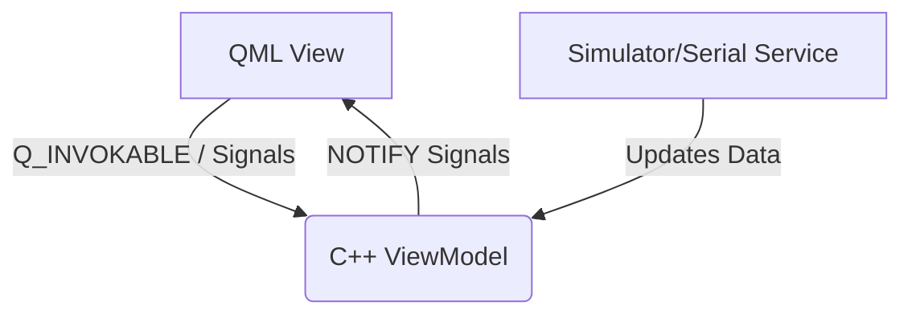

# 🏗️ Architecture: MVVM & Zero-JavaScript Enforcement

> **AI Context**: Detailed specification of data flow between C++ logic and QML rendering.

## 1. The Zero-JavaScript Rule (Absolute Law)
> [!CAUTION]
> Under NO circumstances should JavaScript control flow exist in `.qml` files.

### ❌ FORBIDDEN in QML:
- Imperative functions (`function doMath() { ... }`)
- Control flow (`if`, `for`, `switch`)
- State mutations (`onClick: { myVar += 1 }`)

### ✅ ALLOWED in QML:
- Property bindings (`width: parent.width * 0.5`)
- Simple ternary operators for styling (`color: vm.isWarning ? "red" : "white"`)
- Direct `Q_INVOKABLE` calls (`onClicked: vm.startEngine()`)

## 2. Layered Data Flow


## 3. MVVM Implementation Standard
Every ViewModel must inherit from `QObject`, use `Q_OBJECT`, and expose state via `Q_PROPERTY`.

```cpp
class VehicleViewModel : public QObject {
    Q_OBJECT
    Q_PROPERTY(double speed READ speed NOTIFY speedChanged)
public:
    double speed() const { return m_speed; }
    Q_INVOKABLE void requestAcceleration();
signals:
    void speedChanged();
private:
    double m_speed = 0.0;
};
```

## 4. Service Swap Invariance
The C++ Backend uses `SimulatorService` (QTimer mocks) or `SerialService` (Hardware UART). The `ViewModel` interface remains identical. QML must NEVER know which service is running.
