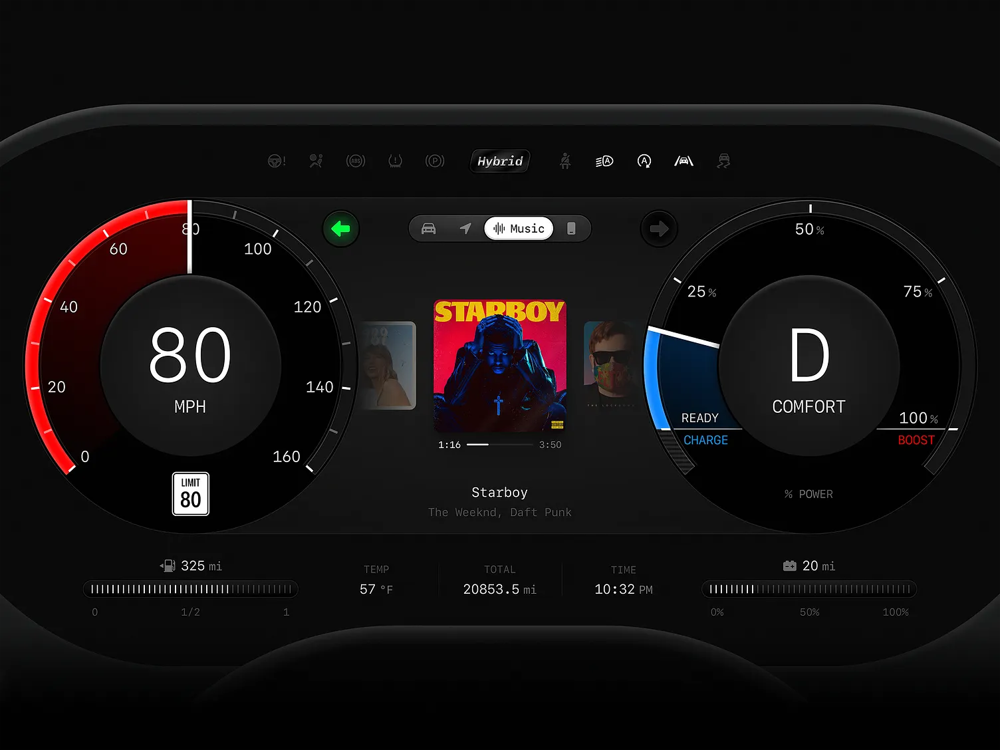

# 🎨 UI/UX & QML Guidelines

> **AI Context**: Design system and animation standards for the Automotive Showcase.

## 1. Aesthetic Philosophy (Neon Cyberpunk)
The interface must feel premium, fluid, and highly glanceable.
- **Backgrounds**: Deep Space Black (`#0B0C10`), Charcoal (`#1F2833`).
- **Accents**: Neon Cyan (`#66FCF1`) for primary active states, Neon Red (`#FF3B30`) for warnings.
- **Typography**: `Inter`, `Roboto`, or `Orbitron`. Use absolute sizing and clear hierarchies.

## 2. Design Tokens (Theme.qml)
> [!IMPORTANT]
> Never hardcode HEX colors in individual QML files. Always bind to the global `Theme` singleton.

## 3. Animation & Fluidity Mandate
Data changes from C++ (like RPM or Speed) can be noisy. QML must smooth these out visually.
```qml
// Apply smoothing to raw hardware telemetry
Text {
    text: vm.speed
    Behavior on text {
        NumberAnimation { duration: 200; easing.type: Easing.OutCubic }
    }
}
```

## 4. Adaptive State Switching
Transitioning between Bike and Car modes must be handled declaratively using QML `States` and `Transitions`. Do not use manual X/Y calculations in JS.

## 5. Design Inspiration (Holographic 3-Panel)
The layout is inspired by a modern, 3-panel digital dashboard design. We map this to our Cyberpunk theme as follows:
- **Left Panel (Speed):** Cyan glowing segmented arcs for gauges, shifting to red at high speeds.
- **Center Panel (Media/Nav):** A floating glassmorphism/holographic card with a charcoal background and cyan borders.
- **Right Panel (Gear/Power):** Pulsing energy rings.
- **Status Bars:** Segmented blocks (`||||||||`) for battery/fuel to mimic energy cells.


